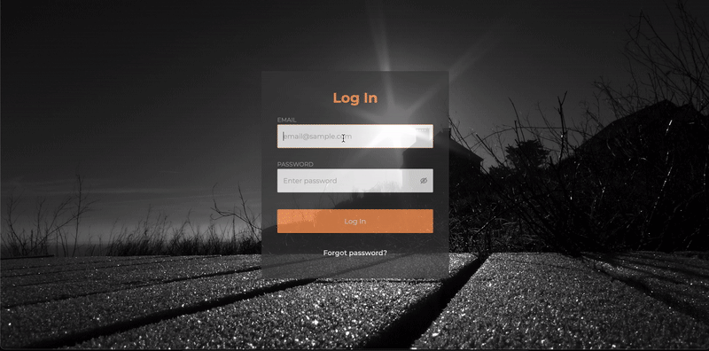
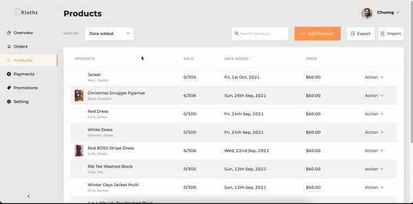

## Klothz Ecommerce Website

Live-demo website: <a href="https://klothz.netlify.app/" target="_blank">Klothz</a>

• Developed a fullstack ecommerce website for with multi-role system for buying and selling clothes. Utilizing MERN stack, ChartJs and Ant Design frameworks, the project not only delivered a user-friendly platform
for consumers to buy clothes but also provided a useful management tool for the business owner to keep track of the orders and products.

Backend Github: https://github.com/cqnguy23/DSV_Backend

Backend Deployed Link: https://jag-final-project.herokuapp.com/api

Flow of website:

|  |
| :-----------------------------: |
|         _Admin Orders_          |

|  |
| :-------------------------------------: |
|            _Admin Products_             |

|  |
| :-------------------------------: |
|     _Consumer Products Flow_      |
